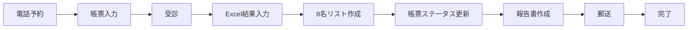

# プロジェクト制約・ルール

## 技術制約

### 使用ツール
- **帳票管理**: Google スプレッドシート
- **結果入力**: Excel（マクロ付き .xlsm）
- **データ共有**: Google Drive
- **自動化**: Google Apps Script
- **外部連携**: なし（将来的に検討）

### システム連携の制約
1. **電子カルテ（セコム）**
   - API連携: 不可
   - データ出力: 手動転記のみ
   - 影響: 転記ミスのリスク、作業時間増加
   - 対策: チェックリスト必須、ダブルチェック推奨

2. **予約管理システム**
   - データ出力機能: なし
   - 電話予約がメイン
   - 影響: 予約情報は手入力
   - 対策: 入力規則で入力ミス防止

3. **Excel処理制約**
   - ローカルファイルのみ
   - 8名単位での処理
   - マクロによる自動判定機能あり
   - Google スプレッドシートとの直接連携不可

---

## データ管理ルール

### 命名規則

#### ファイル命名規則
```
形式: YYYYMMDD_氏名_ステータス.拡張子

例:
- 20251017_山田太郎_受診完了.xlsm
- 20251017_鈴木花子_報告書作成中.pdf
- 20251017_健診結果8名リスト.xlsm
```

#### フォルダ命名規則
```
形式: YYYY年MM月/

例:
- 2025年10月/
- 2025年11月/
```

#### 管理ID命名規則
```
形式: YYYY-NNNN

例:
- 2025-0001（2025年1件目）
- 2025-0234（2025年234件目）
```

### フォルダ構造
```
01_健診結果入力/
├── 00_管理ドキュメント/          # プロジェクト管理
├── 01_ドキュメント/              # システムドキュメント
├── 10_個別結果/                  # 個別健診結果表
│   └── YYYY年MM月/
├── 20_一覧表/                    # 8名リスト一覧表
│   └── YYYY年MM月/
├── 30_人間ドック/                # 人間ドック関連
│   ├── web/                      # Web公開用
│   ├── 資料/                     # 参考資料
│   └── 共有用/                   # 共有ファイル
├── 90_資料/                      # プロジェクト資料
└── kenshin/                      # 開発用コード
```

---

## ワークフロー定義

### 基本フロー


### ステータス定義
1. **予約済** - 予約受付完了、受診前
2. **受診完了** - 受診完了、結果入力前
3. **結果入力中** - Excel入力作業中
4. **報告書作成中** - 8名リスト作成、報告書作成中
5. **郵送済** - 報告書郵送完了
6. **完了** - 全工程完了

### ステータス遷移ルール
- 予約済 → 受診完了（受診日当日または翌日）
- 受診完了 → 結果入力中（検査結果受領後）
- 結果入力中 → 報告書作成中（8名分入力完了後）
- 報告書作成中 → 郵送済（報告書作成・郵送完了後）
- 郵送済 → 完了（郵送から3営業日後）

---

## データ項目定義

### 帳票管理項目（37列）
基本情報、検査項目、ステータス管理項目を含む
詳細は `01_ドキュメント/data-mapping.md` を参照

### 必須入力項目
1. 管理ID
2. 氏名
3. 生年月日
4. 性別
5. 受診日
6. 受診コース
7. ステータス
8. 担当者

### オプション項目
- 連絡先
- 特記事項
- オプション検査
- 過去受診歴

---

## セキュリティ・アクセス管理

### Google Drive アクセス権限
- **閲覧権限**: 全スタッフ
- **編集権限**: 健診担当者のみ
- **管理者権限**: プロジェクトリーダー

### データ保護
- 個人情報は Google Drive のみで管理
- ローカルPCへのダウンロードは必要最小限
- 使用後は速やかに削除

---

## 運用ルール

### 日次作業
1. **朝**: 予約確認、当日受診者リスト確認
2. **受診後**: 帳票ステータス更新
3. **夕方**: 結果入力進捗確認、期限チェック

### 週次作業
1. **月曜**: 週次進捗確認
2. **金曜**: 週次報告書作成、未完了案件確認

### 月次作業
1. **月末**: 月次集計レポート作成
2. **翌月初**: 前月分の最終確認、アーカイブ

---

## エラー処理・例外対応

### 転記ミス発生時
1. エラー内容を記録
2. 正しいデータに修正
3. チェックリストの見直し
4. 再発防止策の検討

### システムエラー発生時
1. エラー内容をスクリーンショット保存
2. `01_ドキュメント/troubleshooting.md` を確認
3. 解決できない場合は管理者に連絡

### 期限遅延発生時
1. 遅延理由を記録
2. 新期限を設定
3. 関係者に通知
4. 進捗モニタリング強化

---

## 品質管理

### チェックポイント
1. **入力時**: 必須項目チェック、形式チェック
2. **転記時**: ダブルチェック、チェックリスト使用
3. **完了前**: 最終確認、上長承認

### 品質基準
- 転記ミス率: 0.5%以下
- 期限遵守率: 95%以上
- ステータス更新遅延: 1営業日以内

---

## 変更管理

### ルール変更プロセス
1. 変更提案
2. 影響範囲の確認
3. 関係者への通知
4. ドキュメント更新
5. 周知・トレーニング

### バージョン管理
- ドキュメント: 更新日とバージョン番号を記載
- スプレッドシート: 変更履歴を記録
- Excel: ファイル名に日付を含める

---

## UI開発ルール（重要）

### ポータル優先の原則
**ユーザー向けUI機能の追加・修正は、Webポータル（`templates/`配下）のみで行う。**

| 対象 | 修正可否 | 理由 |
|------|---------|------|
| `templates/portal.html` | ✅ 可 | メインUI |
| `templates/js.html` | ✅ 可 | フロントエンドロジック |
| `templates/css.html` | ✅ 可 | スタイル |
| `portalApi.gs` | ✅ 可 | ポータル用API |
| `patientManager.gs` (モーダルダイアログ) | ❌ **禁止** | 二重管理を避けるため |
| `main.gs` (スプレッドシートメニュー) | ⚠️ メニュー構造のみ | 機能追加はポータルで |

### スプレッドシートメニューの位置づけ
- **目的**: CSV取込、設定変更などバックエンド操作のみ
- **禁止**: 受診者検索/詳細表示/編集などのUI機能追加
- **理由**:
  1. ポータルとの二重管理による保守コスト増大
  2. UI一貫性の維持が困難
  3. モーダルダイアログはGAS制限によりUX低下

### 新機能追加時のチェックリスト
- [ ] ポータル（`templates/`）で実装しているか？
- [ ] `portalApi.gs`にAPI関数を追加したか？
- [ ] スプレッドシートメニューに同等機能を追加していないか？

---

## 禁止事項

1. 個人情報の外部持ち出し
2. 未承認のツール使用
3. ルール無視の独自運用
4. データの無断削除・変更
5. アクセス権限の無断変更
6. **スプレッドシートメニューへのUI機能追加**（ポータルで実装すること）

---

## 改善提案

### 提案方法
1. GitHub Issues（推奨）
2. メール
3. 定例会議での提案

### 評価基準
- 業務効率化への貢献度
- 実装の容易性
- リスクの少なさ
- コストパフォーマンス

---

## 参考資料
- `ROAD_MAP.md` - プロジェクトスケジュール
- `1220_new/SYSTEM_DESIGN_SPECIFICATION.md` - システム設計（正本）
- `01_ドキュメント/` - 各種技術ドキュメント
