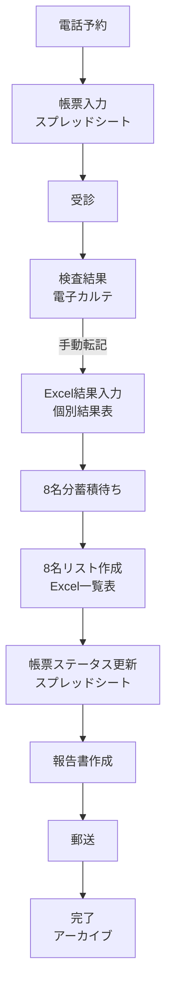

# システム設計書

## システム概要

### 目的
健診結果の管理を効率化し、転記ミスを削減、進捗を可視化する

### スコープ
- 予約管理から報告書作成までの一連のフロー
- 個別結果表と8名リスト一覧表の管理
- ステータス管理と進捗可視化
- 人間ドック関連の料金・検査項目管理

---

## アーキテクチャ

### システム構成図
```
┌─────────────────────────────────────────────────┐
│           Google Workspace                      │
│  ┌──────────────────────────────────────┐      │
│  │  帳票管理スプレッドシート (中央管理)  │      │
│  │  - 受診者情報                         │      │
│  │  - ステータス管理                     │      │
│  │  - 進捗ダッシュボード                 │      │
│  └──────────────────────────────────────┘      │
│           ↑                    ↑                │
│           │                    │                │
│  ┌────────┴─────┐     ┌────────┴─────────┐    │
│  │ Google Drive  │     │ Apps Script      │    │
│  │ ファイル管理   │     │ 自動化処理       │    │
│  └───────────────┘     └──────────────────┘    │
└─────────────────────────────────────────────────┘
           ↑                    ↑
           │(手動転記)           │(CSV連携)
           │                    │
┌──────────┴────────────┐ ┌─────┴──────────┐
│  電子カルテ(セコム)    │ │  Excel (ローカル)│
│  - 検査結果           │ │  - 個別結果表     │
│  - 診察記録           │ │  - 8名リスト      │
└───────────────────────┘ └──────────────────┘
```

---

## データフロー設計

### フロー図


### データの流れ
1. **予約 → 帳票登録**
   - 入力: 電話予約情報
   - 処理: スプレッドシートに新規行追加
   - 出力: 管理ID発番、ステータス「予約済」

2. **受診 → 検査結果**
   - 入力: 受診実施
   - 処理: 電子カルテに検査結果記録
   - 出力: 検査結果データ

3. **結果入力 → 個別結果表**
   - 入力: 電子カルテの検査結果
   - 処理: Excel個別結果表に手動転記
   - 出力: .xlsmファイル（マクロで判定自動化）

4. **リスト作成 → 8名一覧**
   - 入力: 個別結果表 × 8名分
   - 処理: Excelマクロで一覧表作成
   - 出力: 8名リスト.xlsm

5. **ステータス更新 → 完了管理**
   - 入力: 各工程の完了通知
   - 処理: スプレッドシートのステータス更新
   - 出力: 進捗ダッシュボード更新

---

## ステータス管理

### ステータス一覧
| ステータス | 説明 | 期限 | 次アクション |
|-----------|------|------|------------|
| 予約済 | 予約受付完了 | 受診日 | 受診実施 |
| 受診完了 | 受診完了、結果待ち | 受診日+3日 | 結果入力開始 |
| 結果入力中 | Excel入力作業中 | 受診日+7日 | 8名分完了待ち |
| 報告書作成中 | 8名リスト作成中 | 受診日+10日 | 報告書完成 |
| 郵送済 | 報告書郵送完了 | 郵送日+3日 | 完了確認 |
| 完了 | 全工程完了 | - | アーカイブ |

### ステータス遷移ルール
```
予約済 ─(受診)→ 受診完了 ─(入力開始)→ 結果入力中
                                         ↓
                                      (8名完了)
                                         ↓
完了 ←(郵送確認)─ 郵送済 ←(作成完了)─ 報告書作成中
```

### アラートルール
- **期限1日前**: 黄色アラート（メール通知）
- **期限当日**: オレンジアラート（メール通知）
- **期限超過**: 赤色アラート（メール通知 + 上長通知）

---

## データモデル

### 帳票管理スプレッドシート（中心テーブル）

#### 基本情報
| 列名 | データ型 | 必須 | 説明 |
|-----|---------|------|------|
| 管理ID | テキスト | ○ | YYYY-NNNN形式 |
| 受診日 | 日付 | ○ | YYYY/MM/DD形式 |
| 氏名 | テキスト | ○ | フルネーム |
| カナ | テキスト | ○ | 全角カタカナ |
| 生年月日 | 日付 | ○ | YYYY/MM/DD形式 |
| 年齢 | 数値 | ○ | 自動計算 |
| 性別 | 選択 | ○ | 男性/女性 |
| 連絡先電話 | テキスト | - | ハイフンあり |
| メールアドレス | テキスト | - | - |

#### 検査情報
| 列名 | データ型 | 必須 | 説明 |
|-----|---------|------|------|
| 受診コース | 選択 | ○ | 定期/雇入/人間ドック |
| 検査項目 | テキスト | - | カンマ区切り |
| オプション検査 | テキスト | - | カンマ区切り |
| 人間ドックコース | 選択 | - | ライト/消化器/プレミアム/がん |

#### ステータス管理
| 列名 | データ型 | 必須 | 説明 |
|-----|---------|------|------|
| ステータス | 選択 | ○ | 6段階 |
| 担当者 | 選択 | ○ | スタッフ名 |
| 予約日 | 日付 | ○ | - |
| 結果入力開始日 | 日付 | - | - |
| 8名リスト作成日 | 日付 | - | - |
| 報告書作成日 | 日付 | - | - |
| 郵送日 | 日付 | - | - |
| 完了日 | 日付 | - | - |
| 期限 | 日付 | ○ | 自動計算 |
| 遅延日数 | 数値 | - | 自動計算 |

#### その他
| 列名 | データ型 | 必須 | 説明 |
|-----|---------|------|------|
| 特記事項 | テキスト | - | - |
| 個別結果表ファイル名 | テキスト | - | リンク |
| 8名リストファイル名 | テキスト | - | リンク |
| 備考 | テキスト | - | - |

---

## Excel構造

### 個別結果表 (10_個別結果/)
**ファイル**: `20250908_フォーマット健康診断結果表(サンプル値あり).xlsm`

#### シート構成
- **項目評価**: メインシート（入力・判定）
- **判定マスタ**: 判定基準定義
- **基準値一覧**: 検査基準値

#### 主要機能
- VBAマクロによる自動判定（A/B/C/D判定）
- 性別による判定基準切り替え
- 糖尿病判定特殊処理
- 基準値外検出

#### データ項目（主要）
- 身体測定: 身長、体重、BMI、腹囲、血圧
- 聴力検査: 1000Hz、4000Hz
- 血液検査: 37項目（WBC、RBC、Hb、HbA1c、肝機能、脂質、等）
- 尿検査: 尿一般、尿沈渣

### 8名リスト一覧表 (20_一覧表/)
**ファイル**: `20250908_フォーマット健康診断結果一覧表.xlsm`

#### シート構成
- **一覧表**: 8名分の結果を横並び表示
- **オプション用**: オプション検査専用

#### 主要機能
- 8名分のデータを1シートに集約
- 企業提出用フォーマット
- 印刷最適化レイアウト

---

## 人間ドック管理

### コース定義
| コース名 | 料金 | 主要検査 |
|---------|------|---------|
| 生活習慣病ドック | 40,000円 | 血液、GS、心電図、胸部X線 |
| 消化器ドック | 60,000円 | 血液、GS、CS、腫瘍マーカー |
| 全身スクリーニング | 160,000円 | 血液、GS、CT、全身MRI |
| がんスクリーニング | 70,000円 | 血液、GS、腫瘍マーカー、画像 |

### Web公開用ファイル (30_人間ドック/web/)
- `medical-checkup-pricing.html`: 料金表
- `medical-checkup-pricing-wordpress.html`: WordPress用料金表

---

## 自動化設計（Google Apps Script）

### 日次処理
```javascript
// 毎朝8:00実行
function dailyCheck() {
  // 1. 期限チェック
  checkDeadlines();

  // 2. アラートメール送信
  sendAlerts();

  // 3. ダッシュボード更新
  updateDashboard();
}
```

### 週次処理
```javascript
// 毎週月曜9:00実行
function weeklyReport() {
  // 1. 週次進捗レポート作成
  createWeeklyReport();

  // 2. 未完了案件リスト作成
  createPendingList();

  // 3. メール送信
  sendWeeklyReport();
}
```

### 月次処理
```javascript
// 毎月1日10:00実行
function monthlyReport() {
  // 1. 月次集計
  createMonthlyStats();

  // 2. 前月分アーカイブ
  archivePreviousMonth();

  // 3. 新月フォルダ作成
  createMonthFolder();
}
```

---

## インターフェース仕様

### CSV連携フォーマット

#### エクスポート（Excel → CSV）
```csv
管理ID,氏名,生年月日,性別,受診日,検査結果...
2025-0001,山田太郎,1980/01/01,男性,2025/10/17,...
```

#### インポート（CSV → スプレッドシート）
- 文字コード: UTF-8
- 区切り文字: カンマ
- 改行コード: LF

---

## エラーハンドリング

### エラー分類
1. **入力エラー**: 必須項目未入力、形式不正
2. **システムエラー**: Apps Script実行エラー
3. **連携エラー**: CSV読み込みエラー
4. **業務エラー**: 期限超過、重複登録

### エラー対応フロー
```
エラー発生
  ↓
エラーログ記録
  ↓
担当者通知
  ↓
トラブルシューティング参照
  ↓
解決 or 管理者エスカレーション
```

---

## パフォーマンス設計

### 想定データ量
- 月間受診者: 約50-100名
- 年間受診者: 約600-1,200名
- スプレッドシート行数: 年間1,200行程度

### パフォーマンス目標
- スプレッドシート読み込み: 3秒以内
- Apps Script実行: 30秒以内
- ダッシュボード更新: 5秒以内

---

## セキュリティ設計

### アクセス制御
- Google アカウント認証必須
- 編集権限は健診担当者のみ
- 閲覧権限は全スタッフ

### データ保護
- 個人情報はGoogle Drive内のみ
- 定期バックアップ（週次）
- アクセスログ記録

---

## 拡張性

### 将来的な拡張案
1. **API連携**
   - 電子カルテとのAPI連携（セコムが対応した場合）
   - 予約システムとの連携

2. **追加機能**
   - 受診者ポータル（結果閲覧）
   - スマホアプリ化
   - AI自動判定補助

3. **他システム連携**
   - 会計システム連携
   - 予約管理システム連携

---

## 技術スタック

### フロントエンド
- Google スプレッドシート（UI）
- Google Apps Script（HTML Service）

### バックエンド
- Google Apps Script
- JavaScript（ES5互換）

### データストレージ
- Google Drive
- Google スプレッドシート

### 外部ツール
- Microsoft Excel（.xlsm、VBA）

---

## 運用監視

### 監視項目
1. **システム稼働率**: Apps Script実行成功率
2. **データ品質**: 転記ミス率、入力ミス率
3. **業務効率**: 処理時間、期限遵守率
4. **ユーザー満足度**: フィードバック収集

### KPI
- 転記ミス率: 0.5%以下
- 期限遵守率: 95%以上
- システム稼働率: 99%以上
- 処理時間短縮: 従来比50%削減

---

## 参考資料
- `PROJECT_RULES.md` - プロジェクト制約
- `ROAD_MAP.md` - 開発スケジュール
- `01_ドキュメント/data-mapping.md` - データマッピング
- `01_ドキュメント/api-integration.md` - 連携仕様
